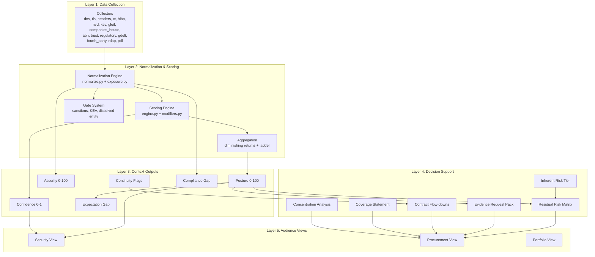

# TPRM Platform — Comprehensive Phase-by-Phase Implementation Plan

**Synthesized from:** [new_add.md](file:///c:/Users/PMYLS/Downloads/Effective-Risk-Management-Work/WahidAI/OSINT_TPRM/new_add.md) · [report.md](file:///c:/Users/PMYLS/Downloads/Effective-Risk-Management-Work/WahidAI/OSINT_TPRM/docs/report.md) · [migration-plan.md](file:///c:/Users/PMYLS/Downloads/Effective-Risk-Management-Work/WahidAI/OSINT_TPRM/docs/migration-plan.md) · [step_by_step_mig_plan.md](file:///c:/Users/PMYLS/Downloads/Effective-Risk-Management-Work/WahidAI/OSINT_TPRM/docs/step_by_step_mig_plan.md) · [complete_plan.md](file:///c:/Users/PMYLS/Downloads/Effective-Risk-Management-Work/WahidAI/OSINT_TPRM/docs/complete_plan.md) · [tprm-module-plan.md](file:///c:/Users/PMYLS/Downloads/Effective-Risk-Management-Work/WahidAI/OSINT_TPRM/docs/tprm-module-plan.md) · [phases.md](file:///c:/Users/PMYLS/Downloads/Effective-Risk-Management-Work/WahidAI/OSINT_TPRM/docs/phases.md)

**Date:** 2026-07-30 · **Baseline:** `scoring.yaml` v4.2.0 · 520 passed, 0 failed · HEAD `817d7da`

---

## Executive Summary

This plan transforms an existing OSINT-based vendor security rating engine into a full **Third-Party Risk Management (TPRM) module** capable of supporting procurement-level supplier decisions. The work is organized into two parallel tracks:

- **Track E (Engine):** 13 phases fixing scoring correctness — removing bias, normalizing by exposure, restructuring aggregation, and adding context outputs alongside the score.
- **Track P (Product):** 8 gaps building the decision-support layer — concentration analysis, evidence packs, contract flow-downs, audience views.

> **The governing principle:** *The score is a component, not the product. A supplier decision needs identity, sanctions, viability, data protection, claim reliability, concentration, and failure consequence. We answer roughly 40% of that from public evidence, say so explicitly, and generate the questions for the rest.*

---

## I. Functionality Status Inventory

### Existing Functionality (✅ Built)

| Capability | Location | Notes |
|---|---|---|
| Penalty-subtractive posture scoring (0–100) | `engine.py`, `scoring.yaml` v4.2.0 | 27 signals, 49 penalising bands (was 57) |
| Confidence axis (0–1) | `engine.py:210-220` | Separate from Posture — best design decision in the model |
| Evidence-before-scoring pipeline | `pipeline.py:145→186` | `store.put(result)` precedes `engine.score` |
| Sanctions gate + entity-ambiguity gate | `pipeline.py`, `scoring_config.py` | Two inline bespoke gates |
| Due diligence pipeline | 27 signals across collectors | Full collector suite: `dns`, `tls`, `headers`, `ct`, `hibp`, `nvd`, `kev`, `gleif`, `companies_house`, `abn`, `trust`, `regulatory`, `gdelt`, `fourth_party` |
| Decision engine | `recommend.py` | Deterministic rule table + `POST /api/vendors/{ref}/decisions` |
| Ongoing monitoring | `monitor.py` | `/api/vendors/{ref}/benchmark-history` |
| Issue/dispute management | `_apply_dispute` in `engine.py:259` | Supports `nullify` and `mitigate` against `(signal, band_key)` |
| Portfolio view | `GET /api/portfolio` | Grade + criticality distribution, blocked/refused/ghost counts |
| Fourth-party dependency mapping | `fourth_party.py` | Per-vendor Tier-2 dependencies identified |
| Frozen regression corpus | `tests/fixtures/golden_scores.json` | 5 vendors, `python -m tests.regolden` |
| Loader validation discipline | `scoring_config.py` | Refuses to start if any penalising band lacks a reason, action, or recheck date |
| No natural-person data | `excluded_signals` in `models.py:335` | APP 10, privacy tort, EU AI Act §4.2 bright line |
| Peer benchmarking v2 | `app/benchmarking/` | ✅ **Delivered 2026-07-30** — 91 tests, `min_quartile_n: 8`, `min_percentile_n: 30` |
| Version control | `.git` | HEAD `817d7da`, 5 commits |
| 26 API endpoints | Various | `/dependencies`, `/evidence`, `/findings`, `/export`, `/compare`, `/disclosures`, `/summary` |

### Partially Implemented (⚠️)

| Capability | Current State | Gap |
|---|---|---|
| Inherent risk tiering | `criticality` collected, sets only `high_stakes` boolean at `recommend.py:76` | Never becomes a formal tier; never drives assessment depth or cadence |
| Fourth-party concentration | Both halves built — `fourth_party.py` + `/api/portfolio` | **Nothing joins them.** Portfolio `concentration` never calls `fourth_party` |
| Industry profiles → Compliance Gap | `industry_profiles` **deleted** (E1 ✅) | Sector obligations need to land in Compliance Gap (E9c), not yet built |
| Low-base-rate reclassification | 8 bands moved to `informational` (E2 ✅◑) | Code landed, **uncommitted** — exit criterion (written justification per vendor) still open |
| Expectation Gap | EB delivers cohort placement, per-domain comparison | Missing: signed `EG` delta as named field, driver attribution sentence |
| Cohort thresholds | EB enforces `min_quartile_n: 8`, `min_percentile_n: 30` in code | v1 `benchmark.py` still ships `min_cohort_n: 1`; pool unseeded |

### Missing Functionality (❌)

| Capability | Status | Target Phase |
|---|---|---|
| Exposure normalization (denominators) | No `exposure.py` exists | E6 (free half) + E12 (collector fan-out) |
| Aggregation / diminishing returns | `aggregation` in `_DOCUMENTATION_ONLY` only; ladder still 40/20/8/3 | E7 |
| Hard gates (beyond sanctions/entity-ambiguous) | No config-driven gate system | E8 |
| Assurity score (0–100) | Zero references in codebase | E9 |
| Compliance Gap findings | Zero references in codebase | E9c |
| Continuity axis (flags) | `business_financial_stability` still a Posture category | E4 |
| Residual Risk matrix | Not built | E10b |
| Evidence Request Pack | 58 `ask_of_vendor` pairs **written and unused** in `scoring.yaml` | P3 |
| Coverage statement | Not built | P2 |
| Contract flow-downs | Not built | P4 |
| Two audience views (Security / Procurement) | Not built | P6 |
| Tier → assessment depth/cadence | Not built | P5 |
| Status-page collector | Not built | P7 |
| Exit / substitutability | Not built | P8 |
| Outcome labels / ground truth | No `outcome_labels.json` anywhere | E0.4 |
| Bounded log-odds scoring | Not built | E13 |
| Category consolidation | Still 7 categories, divisor 4.0 | E5 |

### Planned Future / Deliberately Deferred

| Item | Reason for Deferral |
|---|---|
| Cross-tenant peer pooling | Contractual question before engineering |
| Commercial benchmark import (Bitsight/SSC) | Imports observability bias the model exists to remove |
| Homomorphic encryption / SMPC / differential privacy | `min_cohort_n` is 1; corpus is 5 vendors. Years premature |
| Monte Carlo / Bayesian / ML anomaly detection | No outcome labels exist |
| 300-control framework mapping | For questionnaire systems; this observes from outside |
| Snowflake / Databricks / Tableau | Cargo cult at current scale (FastAPI + 27 signals) |
| Litigation signals | HELD — no free authoritative source |
| Credential / dark-web exposure | HELD — HIBP domain API is paid |
| ESG / modern slavery | HELD — pending Modern Slavery data licence |
| Firmographic severity multipliers | Rejected on five independent grounds |
| Geography/nationality adjustment in Posture | Weakly predictive, ethically fraught, legally exposed |
| Natural-person signals | §4.2 bright line; observability-biased |

---

## II. Core Modules of the TPRM Platform



### Module Dependency Matrix

| Module | Depends On | Depended On By |
|---|---|---|
| **Collectors** | External APIs, rate limiter | Normalization, Evidence Store |
| **Normalization** | Collectors, scoring.yaml | Scoring Engine, Gate System |
| **Scoring Engine** | Normalization, modifiers | Posture, Confidence |
| **Exposure Normalization** | Collectors (denominators) | Scoring Engine |
| **Aggregation** | Scoring Engine | Posture output |
| **Gate System** | Normalization | Decision, adjudication queue |
| **Assurity** | Normalization (relocated signals) | Evidence Request Pack, Audience Views |
| **Compliance Gap** | Normalization, framework definitions | Evidence Request Pack, Audience Views |
| **Continuity** | Collectors (going-concern signals) | Contract Flow-downs, Audience Views |
| **Expectation Gap** | Posture, Cohort Pool (E11) | Audience Views |
| **Inherent Risk Tier** | Client-supplied `criticality` | Residual Risk Matrix, Assessment Depth |
| **Residual Risk Matrix** | Posture, Inherent Tier | Procurement View |
| **Evidence Request Pack** | Findings, scoring.yaml `ask_of_vendor` | Procurement View, Dispute Workflow |
| **Concentration Analysis** | Fourth-party data, Portfolio | Procurement View |

---

## III. Phase-by-Phase Implementation Plan

### Phase Overview and Sequencing

```
TRACK E — ENGINE (score correctness)          TRACK P — PRODUCT (decision support)
────────────────────────────────────          ─────────────────────────────────────
E0  Instrument + baseline           ✅ E0.1    P1  Fourth-party concentration  ← NOW
     │                                        P2  Coverage statement          ← NOW
     ▼                                        P3  Evidence Request Pack       ← NOW
E1  Remove sector opinion           ✅              │
     ▼                                             ▼
E2  Stop penalising the norm  ✅◑ ──► E3 Merge P4  Contract flow-downs
     ▼                                             │
E4  Relocate going-concern (Continuity)            │
     ▼                                             │
E5  Consolidate categories + divisor ◄─────────────┤
     ▼                                        P5  Tier → depth  (needs E10)
E6  Exposure denominator (free half)               │
     ▼                                        P7  Status pages  (needs E4)
E7  Aggregation + severity ladder                  │
     ▼                                             ▼
E8  Hard gates                                P6  Two audience views
     ▼                                        P8  Exit / substitutability
E9  Assurity + Compliance Gap ──► E2b positive credit
     ▼
E10 Expectation Gap + Inherent Tier
     ▼
E11 Real cohorts
     ▼
E12 Collector fan-out (the big one)
     ▼
E13 Bounded log-odds
```

---

### TRACK E — ENGINE PHASES

---

## E0 · Instrument and Baseline

| Attribute | Value |
|---|---|
| **Objective** | Establish a provable baseline so every subsequent claim of improvement is falsifiable. Without this, "we improved the model" is an assertion, not a demonstration. |
| **Duration** | 2–3 weeks |
| **Risk** | None |
| **Changes Scores** | No |
| **Status** | ✅ E0.1 done (520 pass / 0 fail). E0.2–E0.5 outstanding |

### Key Action Steps

- [x] **E0.1 — Resolve 15 pre-existing test failures** → Done (`6752556`). Suite is 520 passed / 0 failed
- [ ] **E0.2 — Extend the regression corpus** — Currently 5 vendors, all large, all A/B. Cannot see regressions affecting small vendors, low scorers, or Ghosts. Add: one Ghost (confidence < 0.4), one gated vendor, one small vendor, one bottom-quartile scorer
- [ ] **E0.3 — Run discrimination analysis on seeded pool** — Measure signal firing rates across 115 seeded vendors. Key finding from 5-vendor corpus: **19 of 27 signals contribute nothing to ordering** — only 8 discriminate. 6 signals penalise 100% of vendors (≈7 posture points flat tax)
- [ ] **E0.4 — Build outcome label set** — Join seeded pool against HIBP/KEV/regulatory to produce `outcome_labels.json`. **Disclose the bias:** public-breach labels over-represent large scrutinised companies
- [ ] **E0.5 — Freeze baseline artefacts** — `python -m tests.regolden` must reproduce committed golden file byte-for-byte

### Key Deliverables

- Extended regression corpus (≥9 vendors covering edge cases)
- `docs/baseline-distribution.md` — posture histogram, category-penalty shares
- `backend/tests/fixtures/outcome_labels.json` (or explicit deferral with documented consequence)
- Discrimination analysis results committed

### Dependencies & Risks

| Risk | Mitigation |
|---|---|
| Firmographics-only R² exceeds ~0.5, proving score is a size classifier | Makes E6 (exposure denominator) **urgent** — consider running E6 before E1 |
| No outcome labels makes AUC impossible | Run label-free diagnostics (R², Spearman ρ, firing rates) first; defer labels only with written acceptance |
| Corpus extension requires choosing representative edge-case vendors | Use `seed_cohorts.py` (115 vendors, 10 sectors) for population; hand-pick corpus additions |

---

## E1 · Remove Sector Severity Promotion

| Attribute | Value |
|---|---|
| **Objective** | Eliminate the `industry_profiles` mechanism that contradicts the model's own `benchmarks.yaml` and implements the one adjustment every commercial platform declines to implement (dynamic severity adjustment). |
| **Duration** | 1 week |
| **Risk** | Low |
| **Changes Scores** | ≈0 on corpus |
| **Status** | ✅ Done (`817d7da`) |

### Key Action Steps (Completed)

- [x] Delete `industry_profiles:` block from `scoring.yaml` (lines 661–685)
- [x] Remove `promote_severity()` from `scoring_config.py`, `normalize.py`, `engine.py`, `pipeline.py`
- [x] Remove `"industry_profiles"` from `_ENGINE_READS`
- [x] Retain `NormalizedFinding.base_severity` / `.promoted_by` for one release (backwards compatibility)
- [x] **Copy both `basis:` strings** to E9 backlog (APRA CPS 234/230, Privacy Act APP 11, OAIC NDB)

### Key Deliverables

- ✅ `scoring.yaml` with zero `industry_profiles` entries
- ✅ Zero corpus movement (no vendor carries a sector at fixture time)
- ✅ Sector obligations captured in E9 backlog as Compliance Gap framework definitions

### Dependencies & Risks

| Risk | Mitigation |
|---|---|
| Stored receipts with `promoted_by` fields fail to deserialise | Keep deprecated fields for one release; mark with removal version |

---

## E2 · Stop Penalising the Norm

| Attribute | Value |
|---|---|
| **Objective** | Stop charging vendors for not doing what 80–99% of the internet does not do. The single biggest fairness fix for smaller suppliers. |
| **Duration** | 1–2 weeks |
| **Risk** | Low |
| **Changes Scores** | Yes — all corpus vendors gain |
| **Status** | ✅◑ Code landed, **uncommitted** — exit criterion (written justification per vendor) open |

### Key Action Steps

- [x] Reclassify **8 bands** to `informational`: `dnssec.absent`, `caa.absent`, `security_txt.absent`, `program_disclosure.none`, `program_disclosure.marketing_only`, `cert_posture.none_claimed`, `reporting_posture.none`, `reporting_posture.partial`
- [x] Delete orphaned `reasons:` and `actions:` entries for each reclassified band (loader refuses to start otherwise)
- [x] Update `test_actions.py` band count: 57 → 49
- [x] Verify `planned_signal_count()` holds at 27 and confidence does not move
- [ ] **Outstanding:** Write justification per moved vendor in golden scores diff, then commit

### Key Deliverables

- 49 penalising bands (down from 57)
- `planned_signal_count()` == 27 (unchanged)
- Confidence distribution unmoved (asserted, not eyeballed)
- Written justification per corpus vendor committed with golden scores

### Dependencies & Risks

| Risk | Mitigation |
|---|---|
| `benchmark.py` `_is_pass` conflates "costs no points" with "vendor has the control" | EB (delivered) addresses this — `informational` no longer reads as `pass` for prevalence. **Generalise before E3, E4, and E9** |
| Intermediate bands missed in first table revision | Corrected: both `program_disclosure.marketing_only` and `reporting_posture.partial` included |

> [!IMPORTANT]
> **Immediate action required:** Close E2 properly before starting E3. Commit the golden scores diff with a one-line justification per vendor naming which reclassified band accounts for the movement.

---

## E3 · Merge Duplicate Transparency Signals

| Attribute | Value |
|---|---|
| **Objective** | One fact should be charged once. Today a published security contact is counted three times via `security_txt`, `contactability`, and `vd_program`. |
| **Duration** | 0.5 weeks |
| **Risk** | Low |
| **Changes Scores** | Yes |
| **Status** | ❌ Not started |

### Key Action Steps

- [ ] Remove `contactability` from `categories.vendor_transparency_gov` plus its `reasons:` and `actions:`
- [ ] Stop emitting `contactability` from `trust_collector.py`
- [ ] **Recommended:** Keep `contactability` as `informational` rather than deleting it — `planned_signal_count()` stays 27, confidence unmoved, evidence preserved
- [ ] Verify `headers_collector.py:73-84` continues to emit `security_txt` and `vd_program` correctly

### Key Deliverables

- One fact, one charge — asserted by test
- Denominator movement either avoided (recommended) or disclosed

### Dependencies & Risks

| Risk | Mitigation |
|---|---|
| Deleting the signal drops 27→26 and raises every vendor's confidence for no reason | Keep as `informational` (recommended) |
| E3 also moves the corpus — two unjustified re-goldens stacked cannot be told apart | **Commit E2 first**, then E3 separately |

---

## E4 · Relocate Going-Concern to Continuity

| Attribute | Value |
|---|---|
| **Objective** | A vendor entering administration stops being reported as having worse TLS. Insolvency becomes a cited going-concern flag, not a 20-point technical security deduction. |
| **Duration** | 1 week |
| **Risk** | Low |
| **Changes Scores** | Yes — removes ~20 misplaced posture points |
| **Status** | ❌ Not started |

### Key Action Steps

- [ ] Move four signals out of `categories.business_financial_stability`: `entity_status`, `entity_existence`, `entity_maturity`, `domain_registration`
- [ ] Delete associated `reasons:` and `actions:` entries (loader trap)
- [ ] Handle category count drop 7→6 and verify `penalty_divisor` 4.0 still allows score to reach 0 (600/4=150 ✓)
- [ ] Handle `planned_signal_count()` drop 27→23 — either disclose confidence shift or implement per-axis confidence
- [ ] Emit as registry-cited structured flags: *"In administration — Companies House company status, retrieved 2026-07-29"*
- [ ] Confirm `entity_maturity` confidence assurance multiplier (0.96–1.04) still resolves after penalty removal
- [ ] Coordinate with E8: `entity_dissolved` → gate; `lapsed`/`administration` → Continuity flag

### Key Deliverables

- Continuity axis with registry-cited flags (deliberately NOT a 0–100 score)
- No going-concern signal carries a posture penalty — asserted by test
- Every Continuity flag carries a source and retrieval date
- `myob` and `slack` gain 3 posture points (`registration_lapsed`) — expected, verified

### Dependencies & Risks

| Risk | Mitigation |
|---|---|
| Confidence denominator change is unintended | Ship per-axis confidence (Posture over its own signals, Continuity over its own) — the more honest option |
| E8 collision: `entity_dissolved` is both a gate candidate and a Continuity flag | Split: gate for `dissolved`, Continuity flag for `lapsed`/`administration` |
| Legal exposure from publishing going-concern facts | Registry-cited facts only; never publish derived distress indices (credit-rating territory) |

---

## E5 · Consolidate Categories + Recalibrate Divisor

| Attribute | Value |
|---|---|
| **Objective** | "Posture" becomes definable in one sentence — *how exposed is this vendor to compromise*. Fix the divisor so the score scale preserves discrimination. |
| **Duration** | 1–2 weeks |
| **Risk** | Medium — **largest single re-score in the plan** |
| **Changes Scores** | Yes, everywhere |
| **Status** | ❌ Not started |
| **Blocked On** | E2 + E4 (both empty/thin categories that E5 consolidates) |

### Key Action Steps

- [ ] Consolidate to 5 target categories:

  | Category | Signals | n |
  |---|---|---:|
  | Breach & Compromise | `breach_by_data_class` `kev_listed_cve` `nvd_cve` | 3 |
  | Attack Surface & Hygiene | `tls_version` `cert_validity` `hsts` `csp` `x_frame_opts` `stale_hosts` `weak_issuance` | 7 |
  | Identity & Email | `dmarc` `spf` `dkim` | 3 |
  | Transparency | `vd_program` `security_txt` | 2 |
  | Regulatory | `regulator_action` | 1 |

- [ ] Recalibrate `penalty_divisor` using formula `n × (4/7)`: **5 categories → divisor 2.86**
- [ ] Enforce no signal in two categories — the engine keys on `(category, signal)` and charges duplicates twice
- [ ] Decide `regulator_action` cyber/non-cyber: (1) tag relevance in collector *recommended*, (2) keep as-is, or (3) relocate → 4 categories, divisor 2.29
- [ ] Write test: `test_divisor_preserves_maximum_damage` asserting `(n × 100) / divisor ≈ 175`
- [ ] **No category weights introduced** — a penalty model has none; percentages are unfalsifiable
- [ ] Version the model, give notice before shipping — this is the largest single re-score in the plan

### Key Deliverables

- 5 categories, 16 scored signals, no duplicates — asserted by test
- `penalty_divisor` = 2.86 (or 2.29), asserted by test
- `regulator_action` decision recorded in writing
- Corpus re-goldened with per-vendor justification

### Dependencies & Risks

| Risk | Mitigation |
|---|---|
| Transparency category becomes empty if `vd_program` also reclassifies | Assert ≥1 penalising band per category at load; re-derive divisor if needed |
| Divisor left unchanged during restructure silently makes model more forgiving | **Ship divisor in same commit** as category restructure |
| Stored scores from previous versions become incomparable | Append-only storage; version the model; `git revert` as rollback |

---

## E6 · Exposure Denominator (the Free Half)

| Attribute | Value |
|---|---|
| **Objective** | Stop measuring how big a vendor is and start measuring how well they run. Today a 900-host vendor with 6 stale hosts scores identically to a 6-host vendor with 6 stale hosts. |
| **Duration** | 1 week |
| **Risk** | Medium |
| **Changes Scores** | Yes |
| **Status** | ❌ Not started |

### Key Action Steps

- [ ] Create `backend/app/scoring/exposure.py` — pure functions, no config reads:
  ```
  r̂_s = (f_s + α_s) / (D_s + α_s + β_s)       # beta-binomial posterior mean
  g_s = λ_s·r̂_s + (1 − λ_s)·min(1, f_s/κ_s)   # blend rate with absolute floor
  ```
- [ ] Add `"denominator": len(subdomains)` to `stale_hosts` finding value in `ct_collector.py` (one line, no new network calls)
- [ ] Add `denominator: int | None` to `NormalizedFinding`
- [ ] Add `exposure:` block to `scoring.yaml` with per-signal `α`, `β`, `λ`, `κ` and rate→severity thresholds
- [ ] **⚠️ Loader trap:** add `"exposure"` to `_ENGINE_READS` in same commit
- [ ] `subdomain_estate` → informational (becomes denominator only); keep in signal list for count = 27
- [ ] Remove `stale_hosts` from `_COUNT_SIGNALS`
- [ ] Extend dispute machinery for denominator challenges — *"you counted 340 hosts, we operate 40"*
- [ ] Keep behind `exposure.enabled` feature flag for easy revert

### Tests to Write FIRST (Must Fail Against v4.2.0)

```python
def test_large_estate_with_low_stale_rate_beats_small_estate_with_high_rate():
    # Vendor A: 4 hosts, 2 stale → 50%.  Vendor B: 900 hosts, 9 stale → 1%
    # Before: A −16, B −72.  After: A worse than B.

def test_one_of_one_failure_is_not_scored_as_one_hundred_percent():
def test_a_single_severe_finding_is_not_diluted_by_a_large_estate():
```

### Key Deliverables

- A/B inversion test passes (and demonstrably failed before)
- `digital_footprint_assets` penalty falls for large corpus vendors with per-vendor justification
- Published denominator (attribution disputes are a top-two category)
- `exposure.py` with inspectable, unit-testable pure functions

### Dependencies & Risks

| Risk | Mitigation |
|---|---|
| Rate-derived band key breaks dispute `(signal, band_key)` matching | Check `_apply_dispute` against new band keys; extend for denominator challenges |
| `cert_validity` ceiling interaction — once it's a rate, "an expired cert" becomes "3% expired" | Arm ceiling on **apex specifically** — preserves today's semantics |

---

## E7 · Aggregation + Severity Ladder

| Attribute | Value |
|---|---|
| **Objective** | One actively-exploited vulnerability stops being outranked by a dozen missing HTTP headers. Today 12 hygiene failures (56 pts) beat 1 Critical KEV (40 pts). |
| **Duration** | 2–3 weeks |
| **Risk** | Medium |
| **Changes Scores** | Yes |
| **Status** | ❌ Not started |

### Key Action Steps (All Three Must Ship Together)

- [ ] **E7a — Diminishing returns within category:**
  ```
  CategoryPenalty(c) = Σᵢ pᵢ · λ^(rankᵢ − 1)    λ = 0.7, rank by descending pᵢ
  ```
  Restructure `engine.py:143` to collect all of a category's penalties before ranking (currently accumulates inside the loop)
- [ ] **⚠️ Trap:** Move `aggregation` from `_DOCUMENTATION_ONLY` to `_ENGINE_READS`
- [ ] **E7b — Widen the severity ladder:**

  | Level | Now | After |
  |---|---:|---:|
  | Critical | 40 | **50** |
  | High | 20 | 20 |
  | Medium | 8 | **6** |
  | Low | 3 | **1.5** |

- [ ] **E7c — Root-cause deduplication:** KEV > EPSS > CVSS (one penalty); TLS protocol finding absorbs ciphers; CSP `frame-ancestors` satisfies XFO
- [ ] **E7d — Ghost ceiling ramp:** `<40% → no publish (adverse)`, `40-60% → ceiling 80`, `60-75% → 90`, `75-90% → 97`, `≥90% → 100`
- [ ] Preserve `rep.effective_penalty` as post-discount value (stored receipts)

### Key Deliverables

- 1 Critical KEV outranks 12 hygiene failures at ≥3:1 ratio — asserted by test
- Monotonicity: remediation never loses points — **generated inputs, not 3 cases**
- `effective_penalty` sums to published category penalty
- Root-cause dedup modelled as `root_cause:` map in config

### Dependencies & Risks

| Risk | Mitigation |
|---|---|
| Neither half alone reaches the target ratio — 3a alone = 1.78:1, not ≥3:1 | **Ship together**; intermediate state satisfies no one |
| Monotonicity violation — diminishing returns is the common place to introduce it | Write monotonicity test with **generated** inputs before implementation |
| `low: 1.5` is a float — may break tests asserting integer penalties | Check all assertions |

---

## E8 · Hard Gates

| Attribute | Value |
|---|---|
| **Objective** | Some findings stop being negotiable. A vendor with an actively-exploited vulnerability currently publishes at 60 and clears a "≥50" threshold. After E8 it publishes nothing and routes to a human. |
| **Duration** | 1 week |
| **Risk** | Low |
| **Changes Scores** | No — changes **outcomes** |
| **Status** | ❌ Not started |

### Key Action Steps

- [ ] Generalise inline gates (`sanctions`, `entity_ambiguous`) into config-driven `gates:` evaluation pass
- [ ] Add four new gates with named basis:
  - **KEV past CISA due date** on internet-facing data-bearing asset (check `kev_collector` carries due date — **TBD/Action Item**)
  - **Entity dissolved / struck off** — promote from `high` severity to gate
  - **No valid TLS on data-bearing endpoint** — distinct from expired (absent)
  - **Ownership unresolvable** — extends `entity_ambiguous`
- [ ] Preserve sanctions invariant: `gates.sanctions.behaviour == "block"` (legal position, s16(7))
- [ ] Add `_validate_gates` requiring non-empty `basis` per gate
- [ ] Route gated vendors to adjudication queue — confirm `posture=None` renders distinctly from `posture=0`

### Key Deliverables

- Config-driven gate system with named bases, enforced at load
- Gated vendors route to adjudication, not a low score
- Gated vendor visually distinct from zero-scoring vendor in UI

### Dependencies & Risks

| Risk | Mitigation |
|---|---|
| `kev_collector` may not carry CISA due dates | **TBD/Action Item for discovery** — verify collector output before implementing KEV gate |
| Frontend may not distinguish `posture=None` from `posture=0` | Verify rendering; grey is not adverse |

---

## E9 · Assurity + Compliance Gap

| Attribute | Value |
|---|---|
| **Objective** | Answer "how much independent assurance does this vendor have?" (Assurity) and "do their claims match reality?" (Compliance Gap). |
| **Duration** | 3–4 weeks |
| **Risk** | Low |
| **Changes Scores** | No (adds dimensions beside Posture) |
| **Status** | ❌ Not started |

### Key Action Steps

- [ ] **E9a — Assurity (0–100):**
  ```
  Assurity = 100 · σ( A₀ + Σ_j v_j · valid_j · scope_j − Σ_k γ_k · ComplianceGap_k )
  ```
  - Absence never subtracts — a vendor with no certifications has low Assurity, not bad Posture
  - Carry over `targets.py` disciplines: signal never checked ≠ signal failed; control that couldn't exist at vendor's age leaves denominator and is disclosed by name; below `min_controls` publish nothing
- [ ] **E9b — Positive credit (0.5 wk, blocked on E9a):** The 6 signals parked at `informational` in E2 gain positive credit in Assurity. Purely additive; Posture untouched
- [ ] **E9c — Compliance Gap:** Where vendor asserts framework `F` and is observed failing control `c ∈ C(F)`, emit cited finding. Land E1's deleted sector expectations here:
  - `financial_services` → APRA CPS 234 / CPS 230
  - `healthcare` → Privacy Act APP 11 / My Health Records Act / OAIC NDB

### Key Deliverables

- Assurity score (0–100) where absence never subtracts
- Compliance Gap findings class with cited framework violations
- Positive credit path for reclassified signals (E9b)

### Dependencies & Risks

| Risk | Mitigation |
|---|---|
| No bonus mechanism exists in engine until Assurity ships | E9a **must** precede E9b — the dependency runs opposite to original plan |
| Framework definitions needed for Compliance Gap | Start with the two `basis:` strings from E1; expand incrementally |

---

## E10 · Expectation Gap + Inherent Risk Tier

| Attribute | Value |
|---|---|
| **Objective** | Deliver the answer to the entire research question in a sentence: *"Posture 68. Median for financial services, 1,000–10,000 staff, ANZ (n=14): 87. This vendor sits 19 points below its peer group."* |
| **Duration** | 2 weeks |
| **Risk** | Low |
| **Changes Scores** | No |
| **Status** | ◑ E10a largely delivered by EB; E10b not started |

### Key Action Steps

- [ ] **E10a — Expectation Gap:** Build against `app/benchmarking/` (NOT deprecated `benchmark.py`). Outstanding:
  - Named signed `EG` delta as published field (`Posture − E[Posture | cohort]`)
  - Driver attribution: *"the gap is driven by absent DMARC..."* — needs per-signal peer prevalence joined to placement
  - Still gated on E11 for percentiles (EB refuses percentile below n=30)
- [ ] **E10b — Inherent Risk Tier:** Formalise the Tier matrix from `criticality` → formal tier → cadence + gate consequences:

  | Posture ↓ / Inherent → | Low | Medium | High | Critical |
  |---|---|---|---|---|
  | Strong (80–100) | Low | Low-Med | Medium | Med-High |
  | Moderate (60–79) | Low-Med | Medium | High | High |
  | Weak (40–59) | Medium | High | High | Critical |
  | Poor (<40) | Med-High | High | Critical | Critical |

- [ ] Build Residual Risk as a **rendering concern, not a stored score** — a deterministic lookup over two independently disputable inputs

### Key Deliverables

- Signed Expectation Gap delta with driver attribution
- Inherent Risk Tier system driving assessment depth and cadence
- Residual Risk matrix view

### Dependencies & Risks

| Risk | Mitigation |
|---|---|
| Percentiles unreliable until pool is seeded | EB enforces `min_percentile_n: 30` — publish quartile + `rank_of_n` until then |
| Building against deprecated `benchmark.py` would use `min_cohort_n: 1` | Build against `app/benchmarking/` only |

---

## E11 · Make the Cohorts Real

| Attribute | Value |
|---|---|
| **Objective** | Peer comparison stops being illustrative and becomes evidence. |
| **Duration** | Ongoing |
| **Risk** | Low |
| **Changes Scores** | No |
| **Status** | ◑ Thresholds fixed in EB; pool unseeded |

### Key Action Steps

- [ ] Seed the pool: `python -m app.seed_cohorts --all --concurrency 2` (115 vendors, 10 sectors, 4 regions, 3 size bands)
- [ ] **Politeness is not optional** — every collector queries free services; concurrency 2 is the impatient maximum
- [ ] Accept that 115 vendors ÷ 120 cells means most cells won't reach `min_cohort_n: 8` — pool grows with real client assessments

### Key Deliverables

- Seeded peer pool across all sectors/regions/sizes
- Real cohort medians for Expectation Gap and log-odds shrinkage

### Dependencies & Risks

| Risk | Mitigation |
|---|---|
| 120 cohort cells with 115 seeds — many cells stay empty | Widening ladder fills upper rungs (sector-only, sector+size); E11 is ongoing by design |
| Rate limiting and API politeness during seeding | Use `--concurrency 2` maximum; respect `ratelimit.py` |

---

## E12 · Collector Fan-Out

| Attribute | Value |
|---|---|
| **Objective** | Turn a homepage check into an estate assessment: *"TLS 1.0 on 8 of 340 checked hosts"* instead of *"TLS 1.0 on the homepage."* |
| **Duration** | **6–10 weeks** (the research understates this as 3 weeks) |
| **Risk** | **High** |
| **Changes Scores** | Substantially |
| **Status** | ❌ Not started |

### Key Action Steps

- [ ] Decide and **publish** the asset scope — recommended: deterministic hash-sampled set of *N* live names from CT
- [ ] Multi-tenant detection **before** computing `D_s` — `wildcard_seen` already carried at `ct_collector.py:61`
- [ ] Resolve liveness first — CT shows certificates issued, not hosts live; dead names inflate `D_s`
- [ ] Budget runtime × *N* — suite already takes 299s at N=1
- [ ] Re-scope `tls_collector` and `headers_collector` to accept host lists; preserve single-host path for cheap re-scores
- [ ] Apply to 10 Class-P signals only; Class-B signals keep binary treatment
- [ ] Leave `nvd_cve`/`kev_listed_cve` un-normalized and **say so** — no host denominator exists
- [ ] **Do not probe non-public endpoints** — legal position depends on requests being identical to ordinary browser visits

### Key Deliverables

- Multi-host TLS/headers collection with published sampling rule
- Per-signal denominators for 8+ Class-P signals
- Multi-tenant SaaS detection to prevent false penalties
- `cert_validity` ceiling decision: arm on apex specifically (recommended)

### Dependencies & Risks

> [!WARNING]
> This is the **highest-risk, highest-impact phase** in the entire plan. It is a 6–10 week programme that should be planned and resourced separately, not folded into "Phase 2".

| Risk | Mitigation |
|---|---|
| Runtime explosion: N hosts × M collectors × rate limits | Budget carefully; hash-sampling caps N; `ratelimit.py` governs |
| Multi-tenant SaaS bottoming out | Detect naming regularity, shared wildcard certs, uniform infrastructure; exclude from both numerator and denominator |
| Attribution disputes from vendors contesting host counts | Publish denominator, sampling rule, and multi-tenant exclusions |

---

## E13 · Bounded Log-Odds

| Attribute | Value |
|---|---|
| **Objective** | Discrimination returns at the bottom of the scale, where triage matters most. Today a vendor with 3 Criticals and one with 15 both publish as 0. |
| **Duration** | 3–4 weeks |
| **Risk** | Medium-high |
| **Changes Scores** | Substantially |
| **Status** | ❌ Not started |
| **Blocked On** | E11 (real cohorts) |

### Key Action Steps

- [ ] Implement:
  ```
  L̃ = c^τ·L + (1 − c^τ)·L_peer      Posture = 100 · (1 − σ(L̃))
  ```
- [ ] Verify `_synthetic_baseline_peers` removed or hard-excluded from `L_peer`
- [ ] Re-run E7 monotonicity tests against new transform
- [ ] **This is a second release** — new version, notice period, side-by-side publication

### Key Deliverables

- Score that never floors (discrimination preserved at bottom)
- Score that never saturates at top
- Ghost cliff made unnecessary (unmeasurable vendor → cohort median, not free pass)

---

### TRACK P — PRODUCT PHASES

> [!TIP]
> **P1–P3 depend on nothing, take ~3 weeks, and move this from "security rating" to "TPRM module" faster than any engine phase.** They should start immediately and in parallel with Track E.

---

## P1 · Fourth-Party Concentration

| Attribute | Value |
|---|---|
| **Objective** | *"Nine of your twenty-three vendors authenticate through Okta. Four are Tier-1. A single Okta outage removes 17% of your supplier book simultaneously."* |
| **Duration** | Days |
| **Risk** | Low |
| **Dependencies** | None (both halves already built) |
| **Regulatory Driver** | **APRA CPS 230 came into force 1 July 2026** — live regulatory obligation |

### Key Action Steps

- [ ] Extend `GET /api/portfolio` to resolve `fourth_party` per vendor from stored evidence (no new collection)
- [ ] Invert to provider → vendors index
- [ ] Rank by `(vendor_count, max_criticality)`
- [ ] Publish five metrics per provider: dependent vendor count, book share, **critical share** (the board number), category, single point of failure flag
- [ ] **Disclose, never score** — concentration is context, not a penalty

### Key Deliverables

- Provider concentration ranked by critical share
- No fourth-party finding enters any score — asserted by test
- Caveat: Tier-2 visibility only; Tier-3+ requires vendor disclosure

---

## P2 · Coverage Statement

| Attribute | Value |
|---|---|
| **Objective** | Publish what we could not see. Counter-intuitively increases credibility with mature buyers; cheapest legal protection in the plan. |
| **Duration** | Days |
| **Dependencies** | None |

### Key Action Steps

- [ ] Derive mechanically from which collectors returned data plus the fixed HELD list
- [ ] Never hand-written per vendor
- [ ] Output: *"This assessment covers externally observable evidence only. We could not observe: internal access controls, BCP/DR testing, subprocessor contracts, insurance coverage, or Tier-3 supply chain."*

### Key Deliverables

- Per-vendor coverage statement with domain-level confidence
- Honest counterpart to Ghost being adverse rather than neutral

---

## P3 · Evidence Request Pack

| Attribute | Value |
|---|---|
| **Objective** | The bridge from outside-in to inside-out — the feature that makes this a TPRM module rather than a rating. |
| **Duration** | 1–2 weeks |
| **Dependencies** | None (58 `ask_of_vendor` pairs already written in `scoring.yaml`) |

### Key Action Steps

- [ ] Build `GET /api/vendors/{ref}/evidence-request` — render from penalising bands
- [ ] Group by category, order by `effective_penalty` descending
- [ ] Per item: finding, evidence id, `ask_of_vendor` question, `accepts_as_refute` standard, `recheck_after` date
- [ ] Export as PDF/DOCX
- [ ] Link vendor response to `POST /api/vendors/{ref}/disputes`
- [ ] Two renderings:
  - **Procurement:** outbound request, items tagged blocking/condition/informational (derived from severity × Tier)
  - **Security:** inbound worklist, grouped by category, with dispute status

### Key Deliverables

- Dynamic evidence request pack generated from live findings, never a fixed template
- Every item cites its evidence id
- Blocking/condition/informational derived from severity × Tier
- Round-trip works: pack → vendor response → dispute → adjudication → re-score

---

## P4 · Contract Flow-Downs

| Attribute | Value |
|---|---|
| **Objective** | Convert security findings into contractual protections procurement can act on. |
| **Duration** | 1–2 weeks |
| **Dependencies** | P3 |

### Key Action Steps

- [ ] Build lookup table mapping findings → suggested contractual protections:

  | Observed | Suggested Protection |
  |---|---|
  | No published incident-response path | 24–72h breach notification clause |
  | No independent audit evidence | Right-to-audit, or annual SOC 2 delivery |
  | Concentrated fourth-party dependency | Subprocessor change notification + approval right |
  | Going-concern flag | Termination for convenience · escrow · exit assistance |
  | Thin coverage / Ghost | Security questionnaire as condition precedent |
  | Overdue KEV | Remediation SLA with contractual milestone |

- [ ] Mark as *"suggested drafting points, not legal advice"*, cited and versioned

---

## P5 · Tier → Assessment Depth and Cadence

| Attribute | Value |
|---|---|
| **Objective** | Effort matches exposure. Today a stationery supplier gets the same 27-signal treatment as a vendor holding production data. |
| **Duration** | 1–2 weeks |
| **Dependencies** | E10b (Inherent Tier) |

### Key Action Steps

- [ ] Implement tiered collection:

  | Tier | Collection Depth | Cadence |
  |---|---|---|
  | T1 Critical | Full + fourth-party + evidence pack | Quarterly |
  | T2 Important | Full | Semi-annual |
  | T3 Standard | Core signals only | Annual |
  | T4 Low | Screening only (sanctions + entity) | Passive |

---

## P6 · Two Audience Views

| Attribute | Value |
|---|---|
| **Duration** | 2 weeks |
| **Dependencies** | P1–P5 |

### Key Action Steps

- [ ] **Security view:** findings by effective penalty · evidence receipts · category drill-down · per-signal peer comparison · remediation asks · recheck cadence · dispute status
- [ ] **Procurement view:** decision → Residual Risk → Continuity flags → concentration → contract conditions → monitoring cadence → coverage statement → Evidence Request Pack
- [ ] Same immutable score object underneath; `/export` and `/summary` are the rendering seam

---

## P7 · Status-Page Collector

| Attribute | Value |
|---|---|
| **Duration** | 2–3 weeks |
| **Dependencies** | E4 (Continuity axis) |

### Key Action Steps

- [ ] Build collector for vendor status pages and outage history
- [ ] Route to **Continuity, not Posture** — frequent outages are a delivery problem, not a security problem
- [ ] Carry caveat: absence of status page = absence of evidence (Confidence effect, not Continuity finding)

---

## P8 · Exit and Substitutability

| Attribute | Value |
|---|---|
| **Duration** | 1 week |
| **Dependencies** | P1, P5 |

### Key Action Steps

- [ ] Add client-supplied `substitutability` field (same path as `criticality`):
  `sole_source` | `low` | `medium` | `high`
- [ ] `sole_source × poor Posture` = the single most useful procurement alert
- [ ] Derive what is derivable from OSINT: fourth-party dependency → what breaks, sector+cohort → substitutes exist, going-concern → urgency
- [ ] What is not derivable (switching cost, lock-in, data portability) → ask via Evidence Request Pack

---

## IV. Features That Can Be Developed in Parallel

| Stream | Phases | Prerequisite |
|---|---|---|
| **Product Track P1–P3** | Concentration, Coverage, Evidence Pack | **None — start immediately** |
| **Engine Track E0–E7** | All scoring correctness phases | Sequential within track |
| **Gates (E8)** | Fully independent | Can start any time |
| **Assurity + Compliance Gap (E9)** | Independent of E5–E7 | Needs E1 only (already done) |
| **Inherent Tier (E10b)** | Independent of engine phases | Needs client-supplied `criticality` |
| **Cohort Seeding (E11)** | Independent | Can run in background |
| **P4 (Contract Flow-downs)** | Parallel with engine | Needs P3 |
| **P8 (Exit/Substitutability)** | Parallel with engine | Needs P1, P5 |

---

## V. Features That Must Be Completed First

| Prerequisite | Why It Is Hard | What It Blocks |
|---|---|---|
| **E1 → E2** | `_validate_industry_profiles` requires promoted bands to be penalising. Reverse → loader death | E2, E3, all subsequent engine phases |
| **E2 + E4 → E5** | E5 consolidates categories that E2 and E4 empty. Run first → wrong set | E6, E7 |
| **E5 → E6, E7** | Both operate inside category boundaries. Boundaries first = one re-golden | Exposure normalization, aggregation |
| **E9a → E9b** | No bonus mechanism exists until Assurity does | Positive credit for reclassified signals |
| **E11 → E10 percentiles, E13** | No trustworthy peer median without real cohorts | Expectation Gap percentiles, log-odds shrinkage |
| **E0 (git) → everything** | `regolden` diffs are the evidence for every phase | All subsequent phases |

---

## VI. High-Risk Implementation Areas

> [!CAUTION]
> The following areas carry the highest technical and operational risk.

| Area | Risk Level | Why | Mitigation |
|---|---|---|---|
| **E12 Collector Fan-Out** | 🔴 High | 6–10 weeks, runtime explosion, multi-tenant SaaS detection, rate limits, attribution disputes | Hash-sampling, `ratelimit.py`, feature flags, phased rollout |
| **E13 Bounded Log-Odds** | 🟠 Medium-High | Changes the meaning of the number; requires real cohort medians; monotonicity risk | Second release with notice period; side-by-side publication |
| **E5 Category Consolidation** | 🟠 Medium | Largest single re-score; divisor miscalculation silently re-scores everyone | Ship divisor in same commit; `test_divisor_preserves_maximum_damage` |
| **E7 Aggregation** | 🟡 Medium | Monotonicity violation risk; neither half alone reaches target | Ship 7a+7b together; generated-input monotonicity tests |
| **E6 Exposure Normalization** | 🟡 Medium | Dispute machinery breaks on rate-derived band keys | Extend disputes for denominator challenges; feature flag |
| **Continuity Legal Exposure** | 🟡 Medium | Publishing going-concern facts carries different liability than security observations | Registry-cited facts only; never publish derived distress indices |
| **Certificate Lifetime Change** | 🟡 Medium (scheduled) | SC-081v3: 100-day certs Mar 2027, 47-day Mar 2029 | Schedule `cert_validity` weight increase at both boundaries; announce in advance |

---

## VII. Opportunities to Reduce Technical Debt

| Opportunity | Current Debt | Resolution Phase | Impact |
|---|---|---|---|
| `_synthetic_baseline_peers` still ships fake `n=6` | v1 `benchmark.py` misleads readers | ✅ Fixed in EB (Sprint 0) | Trust + honesty |
| `min_cohort_n: 1` in deprecated v1 block | Demo setting survived to production | ✅ EB enforces floors in code | Prevents recurrence |
| Industry profiles contradict benchmarks.yaml | Two config files disagreed | ✅ Fixed in E1 | Consistency |
| 15 pre-existing test failures | Config-vs-test drift | ✅ Fixed in E0.1 | Suite reliability |
| `planned_signal_count` changes silently | Confidence shifts for no evidential reason | E4 (per-axis confidence) | Measurement honesty |
| `count_bands` for stale_hosts | Absolute counts masquerade as hygiene measurement | E6 | Removes size bias |
| `aggregation` in `_DOCUMENTATION_ONLY` | Live-looking rule that scores nothing | E7 | Eliminates dead config |
| Deprecated `benchmark.py` alongside new `benchmarking/` | Two benchmark paths shipping | E11 (cutover) | Reduce confusion |
| Inline bespoke gates | Each new gate requires code changes | E8 | Config-driven extensibility |
| `NormalizedFinding.base_severity`/`.promoted_by` | Deprecated fields from E1 | Remove one release after E1 | Clean data model |

---

## VIII. Effort Summary and Critical Path

### Engine Critical Path

```
E0 (done) → E1 (done) → E2 (close) → E3 → E4 → E5 → E6 → E7
                                                              ≈ 8–11 weeks remaining
```

### Combined Effort Estimate

| Track | Phase | Weeks | Status |
|---|---|---:|---|
| **E** | E0 Instrument | 2–3 | ✅ E0.1 done |
| **E** | E1 Sector opinion | 1 | ✅ Done |
| **E** | E2 Stop penalising the norm | 1–2 | ✅◑ Commit pending |
| **E** | E3 Merge duplicates | 0.5 | ❌ |
| **E** | E4 Continuity relocation | 1 | ❌ |
| **E** | E5 Categories + divisor | 1–2 | ❌ |
| **E** | E6 Denominator (free half) | 1 | ❌ |
| **E** | E7 Aggregation + ladder | 2–3 | ❌ |
| **E** | E8 Gates | 1 | ❌ |
| **E** | E9 Assurity + Compliance Gap | 3–4 | ❌ |
| **E** | E10 Expectation Gap + Tier | 2 | ◑ |
| **E** | E11 Real cohorts | ongoing | ◑ |
| **E** | E12 Collector fan-out | **6–10** | ❌ |
| **E** | E13 Log-odds | 3–4 | ❌ |
| **EB** | Peer benchmarking v2 | — | ✅ Delivered |
| **P** | P1–P3 (Concentration · Coverage · Evidence) | **3** | ❌ **Start NOW** |
| **P** | P4–P8 (Flow-downs · Tier · Views · Status · Exit) | 7–9 | ❌ |

### Total Estimated Effort

- **Engine critical path (remaining):** ~8–11 weeks
- **Engine total (all phases):** ~28–44 weeks
- **Product total:** ~10–12 weeks (runs in parallel)
- **To first value delivery (P1–P3):** ~3 weeks, no dependencies

---

## IX. Governance Obligations

| Trigger | Obligation |
|---|---|
| Any signal reclassification or cost change | **Notice before the change**, not after |
| `planned_signal_count` movement | Confidence shifts for no evidential reason — disclose or ship per-axis confidence |
| Introduction of exposure denominators | **Publish** sampling rule, multi-tenant exclusions, and the denominator itself |
| Category/divisor restructure | **Version the model** and give notice — this is the largest single re-score |
| Severity ladder changes | Label expert-set severities as *expert judgment until calibrated* |
| Cohort placement publication | Make cohort assignment **disputable** — ✅ done in EB |
| Going-concern fact publication | **Registry-cited only.** A derived distress index is credit-rating territory |
| Log-odds scale change | New version, notice period, side-by-side publication |

---

## X. Assumptions Made

> [!NOTE]
> The following assumptions were made where source documents lacked specific detail.

1. **Team size:** The plan assumes a small team (2–3 engineers) can work both tracks, with Track P assignable to separate personnel. No specific team composition is stated in the documents.
2. **Deployment model:** The plan assumes a single-tenant deployment for now; cross-tenant pooling is explicitly parked as a contractual question.
3. **Frontend exists:** The documents reference card rendering, UI views, and PDF/DOCX export, but no frontend architecture is specified. **TBD/Action Item:** Define frontend technology stack and rendering approach for P6.
4. **API versioning:** EB is mounted under `/api/v2` alongside deprecated v1 paths. The plan assumes v1 paths will be removed one release from now. **TBD/Action Item:** Define deprecation timeline.
5. **`kev_collector` due dates:** E8 assumes KEV findings carry CISA due dates. **TBD/Action Item:** Verify collector output before implementing KEV-past-due gate.
6. **Compliance Gap framework definitions:** Only two frameworks (financial services, healthcare) are specified. **TBD/Action Item:** Define framework expansion roadmap for E9c.
7. **Status-page collector scope (P7):** No specific status-page APIs or scraping approach is defined. **TBD/Action Item:** Survey vendor status page formats (Statuspage.io, Instatus, custom) and define collection strategy.
8. **Certificate lifecycle change (SC-081v3):** Weight increase for `cert_validity` needs to be scheduled for March 2027 and March 2029 boundaries. **TBD/Action Item:** Add dated entry to `scoring.yaml` alongside `cert_validity`.

---

## XI. Invariants — What Must Never Change

These properties survive every phase. A change that breaks one is out of scope regardless of merit.

| Invariant | Enforced At |
|---|---|
| Posture and Confidence never collapse into one number | Separate `Score` fields in `engine.py` |
| Missing data reduces Confidence, never Posture | Fixed divisor, `engine.py:187` |
| Evidence stored before scoring | `pipeline.py:145` precedes scoring at 186 |
| Every penalising band has a reason + action + recheck date | Loader refuses to start otherwise |
| No natural-person data | `excluded_signals` — §4.2 bright line |
| Ongoing findings never decay | `modifiers.age.never_decays` |
| Disclosed-never-scored | Fourth parties, concentration, coverage gaps are context |
| Frozen corpus moves deliberately | `python -m tests.regolden` |

---

## XII. What To Tell A Sponsor

1. The score still measures **how big a vendor is** as much as how well it is run — a company entering administration loses 20 points of *technical security* posture, and the biggest penalty for every corpus vendor is a raw host count with no denominator.
2. Fixing that is 10–14 weeks of engine work with a corpus diff proving every step; **the first three phases are done**.
3. Separately and in parallel, **three weeks of product work** — concentration, coverage statement, evidence pack — turns a security rating into something a procurement team can actually sign against, and **none of it has started**.
